#Sketch of Data Structure&Algorithm
By [jas0n1ee](mailto:i@jas0n1ee.me)  
内容皆为白铂老师课件中节选  

-----
##教学内容
###△基本概念
	数据处理 
	数学模型
	算法分析
###△非数值问题
	数据结构
		线性表
		栈
		队列
		树
		图
	非数值算法
		查找
		排序
###△数值问题
	误差分析
	线性方程组
	非线性方程
	拟合与插值
	最优化初步
###△算法设计
	蛮力☺、贪心
	分治、减治
	搜索算法
	动态规划☆
	算法优化
	随机算法
	计算复杂性

-----
#△基本概念
**数据是客观世界的描述&&算法是处理数据的工具**
##数据！
数据是用有意义的符号对客观对象进行地逻辑归纳与描述  
数据是反映客观对象属性的数值  
数据是表达知识的字符的集合   
数据是构成信息和知识的原始材料

##算法？
###`算法是问题的程序化解决方案`  
算法强调的是精确定义的求解过程，而不是问题的答案  
**五个特征**  

	有穷性：算法必须在有限步后结束，且每步必须在有限时间内完成
	确定性：算法的描述必须无歧义，执行结果是确定的且精确地符合要求或期望
	可行性：算法都可通过已实现的基本操作运算的有限次执行来实现
	输入：算法有零个或多个输入，这些输入取自某个特定的对象集合
	输出：算法有一个或多个输出，输出量是算法计算的结果
**好算法的四个标准**  

	正确性
	可读性
	健壮性
	高效率

###☆☆☆**时间复杂度的估算方法**
算法的执行时间=Σ操作的执行次数×操作的执行时间  
算法操作包括**控制结构**和**原操作**  
`顺序结构`，`分支结构`，`循环结构`  
算法的执行时间与**基本操作执行次数**之和成正比

###空间复杂度
	指令空间（Instruction Space）：是用来存储程序指令所需空间  
	数据空间（Data Space）：存储运行过程中常量和变量所需的空间  
	环境空间（Environment Space）：系统为程序运行，特别是函数调用提供的空间
##数学模型与算法
**数据结构是数学模型**   
  
###几种常见的逻辑结构      
  
**常见的存储结构**  
顺序存储  
链式存储

#△非数值问题
##数据结构：具有特定组织结构的数据元素的集合(逻辑结构&存储结构)
###数据元素和数据项  
**数据元素**（Data Element）：数据的基本单位  
**数据项**（Data Item）：数据结构中讨论的最小单位  
##二元关系和抽象数据类型
###二元关系	-《数据结构与算法》1.1.2、1.1.3
   **定义：设集合M和N的笛卡尔积为M×N，M×N的任意子集R称为M到N的一个二元关系。**

		若(a，b)∈R，则称a为R的前件，称b为R的后件  
		若M= N，则R∈M×M称为M上的二元关系
###常见二元关系
	=、≤、≥   
	等价关系  
	偏序关系  
	全序关系  
	逆序关系
等价关系： = 
偏序： ≤ 小于等于，但是不能保证任意两个元素之间可比较
全序： ≤ ，保证任意两个元素之间可比

###抽象数据类型（ADT）-《数据结构与算法》1.3
ADT是一个数学模型及定义在该模型上的一组操作  
数据抽象：描述的是实体的本质特征、功能及外部用户接口  
数据封装：将实体的外部特性和内部实现细节分离，对外部用户隐藏内部实现细节，使得使用和实现分离  
**描述方法：**  

	ADT 抽象数据类型名{
	数据对象：〈数据对象的定义〉
	数据关系：〈数据关系的定义〉
	基本操作：〈基本操作的定义〉
	基本操作名（参数表）
	初始条件：〈初始条件描述〉
	操作结果：〈操作结果描述〉
	} ADT 抽象数据类型名
编者按：ADT不同于伪代码，它更接近于真实的代码，但它的作用并不是编译成程序运行，而是对一个数据类型（结构）做一个代码风格的说明。（至于我说的靠不靠谱你们自己判断吧(╯‵□′)╯︵┻━┻）
##数据的逻辑结构   
  
###几种常见的逻辑结构      
  
**常见的存储结构**  
顺序存储  
链式存储

##线性表  -《数据结构与算法》2.1、2.2、3.1、3.3
**线性表是一种有序结构，长度定义为线性表中元素的个数**  
线性表的合并  

	假设有两个线性表La和Lb，要将两个线性表合并，即将所有在线性表Lb中但不在La中数据元素插入到La中  
线性表的保序归并  

	已知线性表La和Lb中的元素按值的递增顺序排列，要求将两个线性表归并成为一个新的有序线性表Lc

###存储

**顺序存储**   
插入操作复杂度期望  

删除操作复杂度期望  

**单向链表**  ☆似乎这个比较重要

	数据域：存储数据元素
	指针域：指向直接后继结点
插入删除操作复杂度为 遍历O(n)+操作O(1)  
**存在问题：单向链表的插入和删除操作，需单独考虑头结点的情况**
	
	解决方法：带表头结点的单向链表

**双向循环链表** 原理同单向链表
###优缺点

	线性表的顺序存储——顺序表  
	形式：用一组地址连续的存储单元依次存储线性表的数据元素  
	优点：可随机存取  
	缺点：插入和删除操作需要移动表中的数据元素；事先确定规模，空间效率不高  
	
	线性表的链式存储——链表  
	形式：用一组任意的存储单元（附加指针）存储表中的数据元素  
	优点：插入和删除操作无需移动表中的数据元素；无需事先确定规模，空间利用率高  
	缺点：不能随机存取  
##队列-《数据结构与算法》2.5.1-2.5.3、3.2.2
队列是限定在表的一端进行插入，而在另一端进行删除的线性结构  
  

**顺序队列**  
   
 入队：新元素加入rear指示的位置，rear指针进一：`rear = rear + 1 `   
 出队：取出front指示的元素，front指针进一：`front = front + 1`

**循环队列**  
   
rear指向maxSize-1，入队进到0  
front指向maxSize-1，出队进到0  
指针操作的求模（求余）实现  

	出队: front = (front + 1) mod n
	入队: rear =(rear + 1) mod n

**链式队列**  
   
入队时没有队满的问题  
出队时则有**队空的问题**  
  
##栈-《数据结构与算法》2.3、3.2.1、2.4.1、2.4.4
栈是只允许在一端进行插入和删除操作的线性结构  
允许插入和删除操作的一端称
为栈顶（Top），另一端称
为栈底（Bottom）  
  
插入操作称为入栈（Push）
删除操作称为出栈（Pop）  
**顺序栈**  
*时间复杂度*:  
顺序栈的操作，如进栈和出栈，都是O(1)时间复杂度  
**链式栈**  
*时间复杂度:*  
链式栈的基本操作，如进栈和出栈，都是O(1)时间的  
链式栈的建立和销毁是O(n)时间的
###应用
栈的显示应用：括号匹配、表达式求值、进制转换、迷宫求解  
栈的隐式应用：函数调用、递归

##递归
编者按：为什么在这里会提到递归？递归减少了程序的代码量，但却增加了程序的“不稳定因素”。由此引出消除递归的必要，与栈在消除递归中的应用。  
**若一个过程直接地或间接地调用自己, 则称这个过程是递归的**  
斐波那契数列  
汉诺塔问题  
 

	void move(int n, int x, int z, int y) 
	{
		if (n >= 0) 
		{
			move(n-1, x, y, z);
			printf(“Move disk %d from %d to %d”, n, x, z);
			move(n-1, y, z, x); 
		}
	}
当n越大时，递归层数越多，系统容易爆栈，因而要消除递归  
###递归的消除
一部分递归可直接用循环实现其非递归过程  
一部分递归可用递推实现其非递归过程  
很多情形必须借助显式的栈来实现非递归过程

##串-《数据结构与算法》6.8
有限长度的字符序列，即限定数据元素为字符的线性表  
两个串相等当且仅当  

	两个串的长度相等
	每个对应位置的字符相同
###串匹配
	已知目标串T 和模式串P，模式匹配就是要在目标串T 中找到一个与模式串P 相等的子串
**Brute-Force 布鲁特福斯算法**  

    最坏情况下的时间复杂度为O(n×m)  
**KMP 算法**  ☆一定要好好看啊╮(╯▽╰)╭  
当模式P 不匹配时，尽量向右移动最大距离，避免重复  
*预处理函数Next*  

	void Next(char *P) 
	{
		int m = strlen(P); // 模式串P 的长度
		N[0] = 0; // 位置0 处的部分匹配串长度为0
		int i = 1; j = 0; // 初始化比较位置
		while(i < m) 
		{
			if(P[i] == P[j])  // 已经匹配了j+1 个字符
			{			
				N[i] = j+1; // 部分匹配串长度加1
				i++; j++;  // 比较位置各加1
			}
			else if( j > 0) j = N[j-1]; // 移动：用部分匹配串对齐
			else f N[i++] = 0;g //j 在串头时部分匹配串长度为0
		}
	}

KMP 算法的时间复杂度为O(m + n)  
**Boyer-Moore 算法**  
将模式串P 与主串T 的子序列进行反向比较  
若P 包含c，则移动P 使c 在P 中的最后一次出现P[l] 对准T[i]  
否则，移动P 使P[0] 对准T[i+1]  
最坏情况下，算法的时间复杂度为O(n × m + s)  

##树  
树是由n≥0 个结点组成的集合，有一个根（Root）结点，它只有直接后继，无直接前驱  
除根以外的其它结点划分为m > 0 个不相交的有限集合，每个集合又是一棵树，并称之为根的子树  
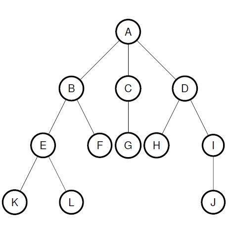 
####与树相关的概念较多，在此不赘述，但请认真了解
###二叉树
二叉树是k = 2 的k 叉树  
二叉树有五种不同形态  
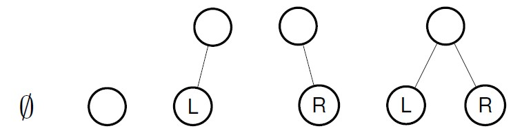  
具有n 个结点的完全二叉树的深度为log2 (n + 1)  
完全二叉树不一定是满的！  
**二叉树的链式存储**   

	数据域：存放数据  
	指针域：存放指向左子树和右子树的指针

	typedef struct tnode 
	{
		ElemType data;
		struct tnode *lchild;
		struct tnode *rchild;
	} TreeNode;
**二叉树遍历**——访问根结点的时机选择  
先序遍历：V - L - R  
中序遍历：L - V - R  
后序遍历：L - R - V  
**以上三种用递归来实现**  
层序遍历 用队列来实现  
**二叉树的建立**  
由二叉树的先序序列和中序序列可唯一地确定一棵二叉树  
###Huffman 树与编码
树的路径长度：从树根到所有叶子结点的路径长度之和  
在所有路径相同的二叉树中带权路径长度最小的树称为Huffman树或最优二叉树  
**构造** 参考离散（贪心算法）    
**Huffman 编码**  
平均编码长度最短
满足前缀编码的性质（任一字符编码都不是其它字符编码的前缀）  
**二叉搜索树**  
在二叉搜索树上可以高效地进行查找

##图
图定义为G = (V,E)  
V 是一个有限集合  
E 是V 中元素的有序（或无序）二元组，即{<v,w> |v,w ∈ V; v ≠w}

某些图的边具有与它相关的数, 称为权，这种带权的图叫做网络  
  

	路径长度是路径上边的数目  
	路径序列中没有重复出现的顶点称为简单路径  
	路径的起点和终点相同（v = v*）称为回路或环  
	除了v 之外，其余顶点不重复出现的回路称为简单回路
**无向图**  
在无向图中，如果从顶点v 到顶点w 有路径，则称v 和w 是连通的  
对于图中任意两个顶点v都是连通的，则称G 是连通图
无向图的极大连通子图称为连通分量  
**有向图**  
在有向图中，如果对于每一对vi，vj ，从vi 到vj 和从vj 到vi 都存在路径，则称G 为强连通图  
有向图的极大强连通子图称为有向图的强连通分量

**欧拉路径**是遍历图中每条边且只访问一次的路径  
终点回到起点的欧拉路径是**欧拉回路**  
###图的存储  
**邻接矩阵表示**  
图的邻接矩阵表示需要与v^2 成比例的存储空间  
网络的邻接矩阵表示：如果将邻接矩阵中元素改为边的权值，邻接矩阵可以用来表示网络  

	空间复杂度O(|V|^2)
	边插入操作O(1)
	边删除操作O(1)
	判边存在操作O(1)
	图的迭代器
		访问某一个顶点的邻接顶点O(|V|)
		访问所有顶点的邻接顶点O(|V|^2)

**邻接表表示**  
采用一个链表数组来表示图  
每个链表头结点为图的顶点  
同一个顶点发出的边链接在同一个链表中  
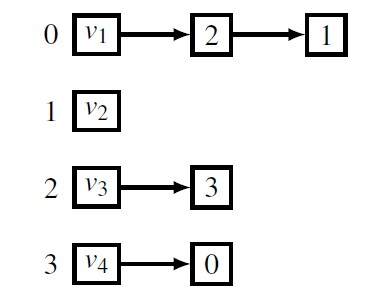 

无向图的邻接表表示需要(|V| + 2|E|) 个链表结点  
**最坏情况时间复杂度分析**  

	空间复杂度O(|V| + c|E|)
	边插入操作O(1)
	边删除操作O(|V|)
	判边存在操作O(|V|)
	图的迭代器
		访问某一个顶点的邻接顶点O(|V|)
		访问所有顶点的邻接顶点O(|V|+ |E|)

对于稠密图，适于采用邻接矩阵表示  
对于稀疏图，适于采用邻接表来表示  
###图的遍历
**深度优先搜索**  
用栈实现

**广度优先搜索**  
用队列实现

##最小生成树
生成树，包含图中全部n 个顶点，但只有n -1 条边  
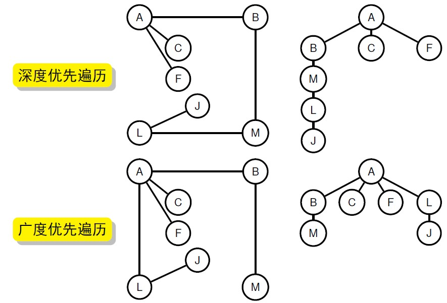   
**最小生成树**对于给定的加权无向连通图，最小生
成树是一棵生成树，并且其权（所有
边的权值之和）不会大于其它任何生
成树的权
**KRUSKAL 算法**  

	对图中所有边按权值进行排序  
	令最小生成树的边集为空  
	从图中取出权值最小的一条边  
		如果这条边与最小生成树中的边能构成环，则舍弃  
		否则，将这条边加入最小生成树  
	重复上述过程，直至将|V|-1 条边加入最小生成树

Kruskal 算法的时间复杂度为O(|E| log|E|)  
Kruskal 算法对于稀疏图是好的选择

**PRIM 算法**  

	初始最小生成树是一个空集  
	首先从图G 中任取一个结点a 加入最小生成树，找出当前非最小生成树的顶点与当前最小生成树直接相连的所有边
	取出最短边，把它和非最小生成树顶点b 加入最小生成树，更新边序列
	重复上述过程，直到最小生成树包括G 中所有结点

Prim 算法的时间复杂度是O（|V|^2)  
对于稠密图，Prim 的邻接矩阵实现是首选方法  
###最短路径  
**单源最短路径**：给定一个起始顶点s，找出从s 到图中其它各顶点的最短路径，即最短路径树  
**全源最短路径**：找出连接图中各对顶点的最短路径  

**Dijkstra 算法**  -单源最短路径

	初始化点集S = {0}，V 为顶点集
	确定各顶点到源点的最短距离
	从V\S 中找出距源点s 最近的结点v
		更新S，使S = S + {v}
		更新各点到源点的距离
	重复步骤3，直至S = V

Dijkstra 算法的时间复杂度为O(|V|^2)  

**全源最短路径**  
对图中每个顶点使用Dijkstra 算法  
or  
**Floyd 算法**  

	初始化|V|×|V| 的矩阵D0 为图的边值矩阵
	对k = 0~n-1进行如下迭代
		Dk[i][j] =min{Dk-1[i][j],Dk-1[i][k]+Dk-1[k][j]}
	|V|×|V| 即为从顶点i 到顶点j 的最短路径长度，这条路径不经过编号大于k 的顶点
	最后得到的就是全源最短路径矩阵

Floyd 算法可以在与O(|V|^3)的时间内计算出一个网中的所有最短路径  
**编者按：这四种算法似乎比较重要，好好看。前三个本质上为贪心，最后一个为动态规划**  
##二分图
(这部分介绍了但算法没细讲，或者我没认真听(╯‵□′)╯︵┻━┻)  
二分图是满足如下性质的图：  
顶点集合V 分割为两个子
集V1 和V2，且满
足V1∪V2 = V 和V1 \ V2 = ∅;  
边集E 中的每条边e 的两个端点必
须在不同的顶点集内  
**二分图匹配**    
匈牙利算法的复杂度为O（n^4)  
**加权二分图的匹配**  
稳定婚姻问题...

#非数值算法
##查找
查找算法的复杂性：关键字/数据规模  
查找表（Search Table）是由同一类型数据元素构成的集合  
平均查找长度：在查找过程中，为确定目标在查找表中的位置，需要进行关键字比较次数的期望值
ASL =ΣPiCi
##顺序查找与索引查找  
####顺序查找
(顺序查找过于简单不再叙述)  
对顺序表顺序查找  
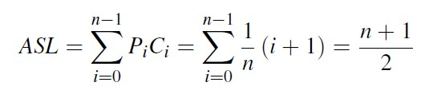  
**折半查找**  
编者按：折半查找就是二分搜索，是一种优化的顺序表查找算法（我也不知道说的对不对）  
折半查找可以用一个二叉树结构来描述  
对于一次查找,无论成功还是失败，折半查找需要的比较次数不会超过log2 N  

**不同表示线性表的查找效率比较**  
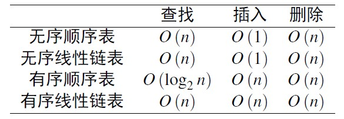   
###索引查找
将有n 个结点的线性表划分为m 个子表，分别存储各子表  
另设一个有m 个结点（索引项）的索引表，每个结点存子表第一个结点的地址及相关信息  
**索引存储方式**  

	索引表——顺序表或链表
	子表——顺序表或链表

索引表特点：表不大，表中元素不常变动  
适合用顺序表来表示索引表  
**索引表为顺序表 子表也为顺序表情况**  
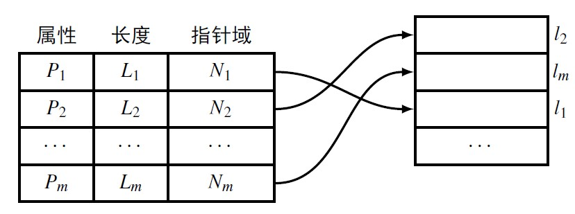  
索引查找比全表顺序查找效率高  

**索引表采用顺序表 子表采用链表情况**  
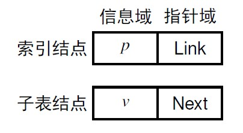  
优点：  
索引表结构简单，便于查找  
子表结点插入、删除不需要移动表中元素

**多重索引**：当索引表很大时，对索引表再做索引  

####分块查找  
分块查找也称索引顺序查找，是顺序查找的改进  
把线性表顺序划分为若干个子表（块）后满足

	子表之间递增（或递减）有序，即后一子表的每一项大于前一子表的所有项
	块内元素可以无序
###多关键字索引文件结构  
**多重表文件**  
	
	次关键字项：经常需要对其查询的数据项（一项或多项）
	次关键字：每个记录的次关键字项的值

多重链表文件结构：  

	1 主文件为顺序文件
	2 对主关键字建立索引表，称为主索引表
	3 主文件中对每个次关键字项设一指针域，用以链接相同关键字的记录（单链表）
	4 对每个次关键字分别建立索引表，称为辅索引表

**倒排文件**  
倒排文件也是一种多关键字索引文件结构,适用于多关键字查询,与多重链表文件相同之处：主文件+主索引表+辅索引表  
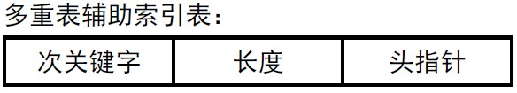  
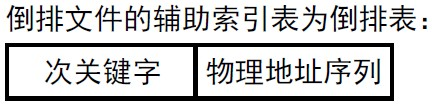   

优点：处理多关键字查询时，通过集合运算直接得到结果  

##二叉搜索树
二叉搜索树（BST：Binary SearchTree）或者是一棵空树，或者是具有下列性质的二叉树：  

	1 每个结点有一个关键字（Key）
	2 任意结点关键字大于等于该结点左子树中所有结点含有的关键字
	3 同时该结点的关键字小于等于右子树中所有结点含有的关键字

二叉搜索树的**插入过程**类似于搜索，在搜索失败后执行插入操作  
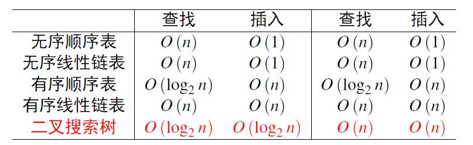  
性能特性  
完美的平衡树是极为罕见的，高度不平衡的树也不多见  
**二叉搜索树中的旋转操作**  
旋转使一棵树中，结点和结点的一个子孙互换角色，但仍然保持结点关键字之间的次序  
右旋转（Right Rotation）涉及到结点及其左孩子  
左旋转（Right Rotation）涉及到结点及其右孩子  
**更多的二叉搜索树**  

	高度平衡的二叉搜索树——AVL树
	实用的比较平衡的二叉搜索树——红黑树
	多路平衡的动态查找结构——B-树

##散列  
**散列表**（Hash）是将一组关键字映射到一个有限的、地址连续的区间上，并以关键字在地址集中的“像”作为相应记录在表中的存储位置  
散列表的冗余度和冲突是一对矛盾  

**散列函数**把关键字映射为存储地址  
散列函数应是简单的，能在较短的时间内计算出结果  
散列函数的定义域必须包括需要存储的全部关键码，如果散列表允许有m 个地址，其值域必须在0 到m - 1 之间  
理想的散列函数应近似为随机的，对每一个输入，相应的输出在值域上是等概的  
####三种方法
**数字分析法**  
仅适用于事先知道表中所有关键码每一位数值的分布情况，完全依赖于关键码集合；若换一个关键码集合，需重新选择  
**平方取中法**  
先计算构成关键码的标识符的内码的平方, 然后按照散列表的大小取中间的若干位作为散列地址  
**折叠法**  
把关键码自左到右分成位数相等的几部分，每部分的位数应与散列表地址位数相同，只有最后一部分的位数可以短一些  
把这些部分的数据叠加起来,就可以得到具有该关键码的记录的散列地址

####冲突问题  
**链地址法**
两个关键字散列到同一地址，也就是冲突问题  
最简单的方法是对每个散列地址建立一个链表，将散列到同一地址的不同关键字存入相应的链表中，这种方法称为**链地址法**  
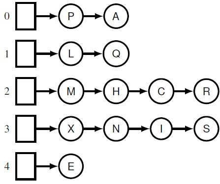   

**开放地址法**  
对表长M 大于元素数目N 的情况，依靠空的存储空间来解决冲突问题，这类方法被称为**开放地址法**  
N 为元素数目，M 为表长，定义负载因子α= N/M  
**散列表的查找**  
查找过程和建表过程一致
假设采用开放定址处理冲突，对于给定值k，计算散列地址
i = Hash (k)

**散列表的删除**  
*在开放定址散列表中，直接对元素进行删除是不行的*

**双重散列**  
双重散列不是检查冲突点后面每一个表位置，而是采用第二个散列函数得到一个固定增量序列用于探测序列

##排序-《数据结构与算法》7.1、7.2
排序的时间开销是衡量算法好坏的最重要的标志  
算法执行时所需的附加存储：评价算法好坏的另一标准  
###冒泡排序
（过于简单不做赘述）
最坏情况：
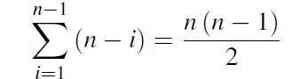  

###插入排序  
直接插入  
折半插入  
希尔（Shell）排序  

**直接插入**  
平均情况下，直接插入排序约需要n^2/4 次比较操作和半交换操作  
**折半插入**  
插入排序算法中，在插入第k 个元素时，前k-1 个元素组成的序列已经是有序的，可以利用折半查找法寻找的第k-1 个插入位置  
长度为k 的序列，折半查找需要经过log2 k+ 1 次比较  
n 个对象用折半插入排序需要进行的比较次数约为nlog2n  
**总的时间复杂度仍然是O（n^2）**  
**希尔排序**  
编者按：就是有步长的排序。。我是这么觉得的..  
好的步长序列：1; 8; 23; 77; 281; 1073 hi=4^(i+1) +3×2^i+1  

###快速排序  -《数据结构与算法》7.3

	将待排序序列a 划分为两个部分，满足下述条件  
		a [i] 位于它在序列中的正确位置
		前面的元素a [l] ~ a [i-1] 都比a [i] 小
		后面的元素a [i + 1] ~a [h] 都比a [i] 大
	然后分别对两个部分进行划分
	每次划分都至少将一个元素放在它最终应该位于的正确位置，直至所有元素都排序完成
其中的**划分操作**  

	l 和r 为序列的第一个和最后一个元素，v 表示划分元素的值，i 表示左侧指针，j 表示右侧指针
	选择a [r] 作为划分元素—，划分后位于正确位置
	从序列的最左边向中间扫描，找到一个比划分元素大的元素
	从序列的最右边向中间扫描，找到一个比划分元素小的元素
	交换这两个元素
	当扫描指针i 和j 相遇时，和划分元素交换，划分完成

性能分析：最好情况时间复杂度为O(N log2N)  
But  
快速排序平均情况下需要lgN 的递归栈，但在最坏情况下可以达到N

###归并排序  -《数据结构与算法》7.4
归并是将两个或两个以上的有序表合并成一个新的有序表  
，二路归并时间复杂度为O(N)
**自底向上的归并排序**  
自底向上归并排序对整个文件进行m-m 的归并操作，每次m 的值都变成两倍  
自底向上归并排序中，每一步进行归并排序的子序列的大小是2 的幂数，最后一个子序列的大小是一个例外  
时间复杂度为O(N log2 N)

**自顶向下的归并排序**  
可用递归实现，原理相同不再赘述。

-----
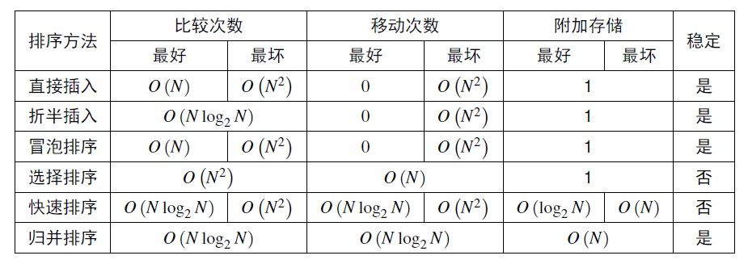  

	基本排序方法在平均情况下的时间复杂度是O（N^2）
	高级排序方法在平均情况下的时间复杂度是O(N logN)
	就平均性能来说，快速排序比归并排序好
	归并排序是稳定的，快速排序是不稳定的，性能可能退化
可以参考B站上的热门视频[15种排序](http://bilibili.kankanews.com/video/av685670/)

#△数值问题
《科学计算导论》1.1、1.2、1.3.1-1.3.9&《数值方法与计算机实现》1.1、1.2  
数值分析/科学计算  

	设计和分析数值型的算法，用于解决科学和工程领域的数学问题

####数值分析研究问题  
	线性方程组
	非线性方程
	最优化问题
	拟合与插值
**解的特性** 存在性、唯一性、最优性、精确性  
**算法的特性** 性能和效率  
####适定性
	解存在
	解是唯一的
	连续地依赖于问题数据
不满足条件的问题，被称为不适定的
####病态性
	解可能对于输入数据很敏感
病态是问题的特性，与所选择的算法没有关系  

##误差分析
###绝对误差&相对误差
	绝对误差= 近似值- 真值
	相对误差= 绝对误差/ 真值
	近似值= 真值×(1 + 相对误差)
	相对误差≈ 估计误差/ 近似值
###误差来源
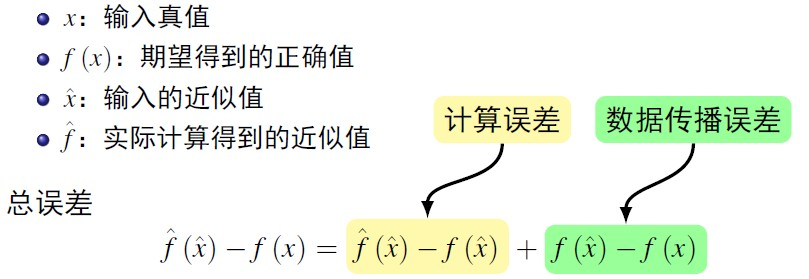
	
	误差= 计算误差+ 数据传播误差
	计算误差= 截断误差+ 舍入误差
###舍入误差

计算机采用的浮点数是实数轴上不等距有限点集  
因此，在计算机的浮点数系上, 四则运算实际上是不封闭的  
###前向误差与后向误差
前向误差（Forward Error）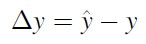  
后向误差（Backward Error）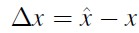  
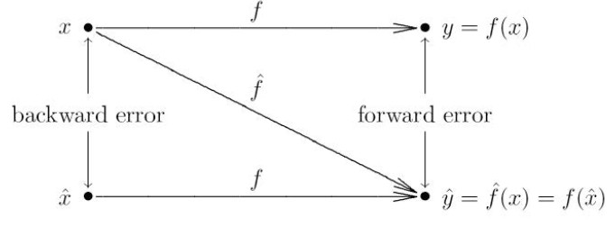  

###敏感性和病态性  
**条件数**表示从输入数据的相对差异到解的相对差异的放大系数  
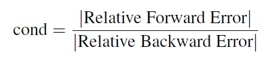   

cond ≤ 1 表明问题是不敏感的，是良态的  
cond >> 1 表明问题是敏感的，是病态的  
实际过程中由于难以求得条件数，往往只能满足于在输入数据的定
义域上得到条件数的估计值，或者得到其上限
**绝对条件数**  

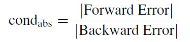   

函数求值和方程求解问题的敏感性是相反的

###浮点数系统
数据x 按照浮点数表示为  
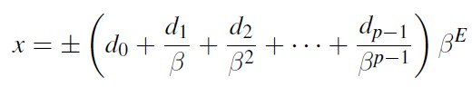  
除非所表示的数为0，否则尾数的首位d0 不为0；满足这个条件的浮点数系统成为正规化的  
最小的正的正规化浮点数为UFL =β^L，称为下溢限  
最大的正的正规化浮点数为OFL = β^(U+1) (1-β^-p)，称为上溢限  
在指数域达到最小值时，允许尾数首位为0，称为次正规化
####舍入误差  
截断：将x 的β基底展开的第p-1 位后之后截去，也称向零舍入法  
最近舍入：取与x 最接近的浮点数，在相等情况取最后一个为偶数
####有效数字
  
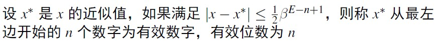   
####相对误差
有n 位有效数字的相对误差  
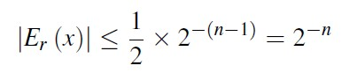  
###溢出
浮点运算还可能导致溢出，下溢可以用0 来表示，而上溢是致命的  
*大数吃小数*  
 *抵消* 两个相近的数相减会造成有效数字的损失

-----
	在计算过程中，误差的存在和产生是不可避免的
	稳定的算法，使得误差在传播过程中是衰减的或者可控的
	对于良态的问题，利用稳定的算法就可以得到满足精度要求的解
	对于误差来源的分析和理解，有助于我们设计出稳定的算法

##线性方程组
矩阵、线性方程组的特性、范数不再赘述，请参考线性代数 或《科学计算导论》2.1、2.2、2.3  
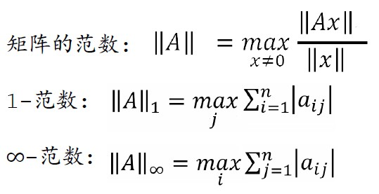   
**矩阵的条件数**  
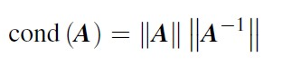  
矩阵的条件数刻画了矩阵对于非零矢量最大的伸展和压缩能力  
矩阵的条件数越大，说明矩阵越接近奇异  

**直接解法**  -《科学计算导论》2.4.1-2.4.8、2.5.1《数值方法与计算机实现》2.1、2.5.1、2.5.2

	高斯消去法
	LU 分解法
	Gauss—Jordan
	Cholesky

由于这部分知识在线性代数中已经学过，就不再过多介绍。  
注意：
	在高斯消元中，对角线上的元素aii会作为除数，如果aii很小或者为0则需要重新选取主元。  

**线性方程组解的精度**  -《科学计算导论》11.5.1-11.5.3《数值方法与计算机实现》2.3
残差向量**r** = **b** -**Ax**  
当A 为良态时，小的相对残差意味着解的相对误差也小  
A 如果病态，稳定的算法可以得到小的残差，但解的精度不一定高

###迭代求解
	不动点迭代
	JACOBI  A = D + (L + U)
	GAUSS-SEIDEL  A = (D + L) + U

**不动点迭代**  
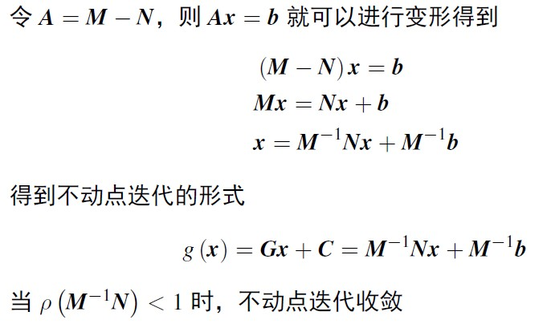  

**雅克比法**  
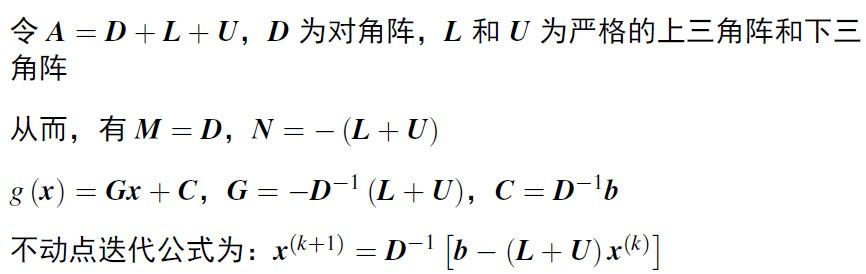  

**高斯赛德法**  
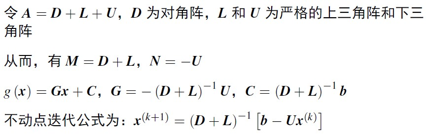  

##非线性方程
**存在性和唯一性**  
如果f (x) 是闭区间[a，b] 上的连续函数，且有f(a)f(b)<0，则一维非线性方程f(x)=0 在区间[a，b] 内一定有的解  
**残差与条件数**  
只有在问题良态的条件下，残差小才意味着解是精确的  
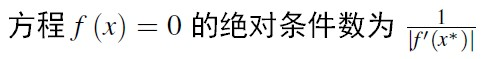  

###非线性方程求解-《科学计算导论》5.1-5.4、5.5.1-5.5.5《数值方法与计算机实现》4.1、4.2、4.4
如果满足下式（C 为大于零的常数），称迭代法的收敛速度为r  
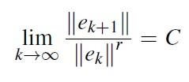  
若r = 1 且C < 1，收敛是线性的（Linear）  
若r > 1，收敛是超线性的（Super-Linear）  
若r = 2，收敛是平方的（Quadratic）  
**二分法**  
在区间内二分查找，较为简单，不过多描述  
二分法的r = 1，C = 0.5  
二分法的收敛速度是线性的  
  
**不动点法**  

	f(x) = g (x) - x  
	xk+1 = g (xk)

如果|g'(x\*)| > 1，不动点迭代式发散的  
如果|g'(x\*)| = C<1，不动点收敛的速度是线性的  
如果|g'(x\*)| = 0，不动点收敛的速度至少是超线性的  

**牛顿法**  
  泰勒展开后截取前两项  

f(xk + h)≈f(xk)+ f'(xk)h  
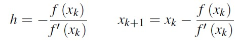  
r = 2，牛顿法是平方收敛的

**割线法**  
割线法是一种准牛顿法  
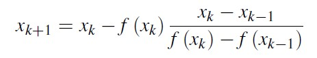

割线法的收敛是超线性的：r = 1.618
 
**反插法**  
割线法利用前两次的迭代值决定一条直线，用这条直线与x 轴的交点作为一下次的迭代值  
r = 1.839

----
	二分法是比较安全的方法，但收敛速度是线性的，效率比较低
	牛顿法、割线法和反插法是超线性收敛的，效率比较高；但是要求初值和真解比较接近，否则有可能不收敛，因此安全性不够好  

在一个较小的有根区间外采用安全的二分法，在区间内采用高效的
迭代方法  
典型例子：二分法+反插法

##优化-《科学计算导论》6.1-6.4、6.5.1-6.5.4
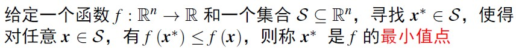  
**全局最小与局部最小**  
概念略  
寻找，甚至验证全局最小值都很困难  
一般优化算法都是寻求局部最小值

**最优解的存在性和唯一性**  
如果f 在有界闭集S上连续，则f 在S 上存在全局最小值  
如果S 不是闭的或无界，则f 在S 上可能没有全局或局部最小值  

**强制函数**  
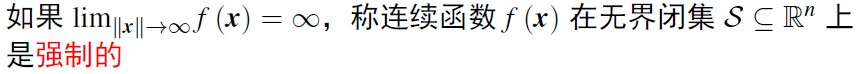  
如果连续函数f 在无界闭集S上是强制的，则f 在S 上存在全局最小值  

**凸集与凸函数**  
概念略  
如果优化问题中的目标函数f 和约束集合S 都是凸的，就称为凸优化问题  

	凸函数f 在凸集S上的任意局部最小值，都是f在S上的全局最小值
	严格凸函数f 在凸集S上的局部最小值，是f在S上的唯一全局最小值
	如果f 在有界闭集S上严格凸，则f在S上存在唯一的全局最小值
	如果f 在无界闭集S上严格凸，则f在S上存在唯一全局最小值的充要条件是f 在S上是强制的

####无约束优化
一维求导不再赘述  
**海森矩阵**  
	
	对f 的临界点x*，观察海森矩阵在x* 的性质
	如果Hf (x) 正定，则x* 是f 的最小值点
	如果Hf (x) 负定，则x* 是f 的最大值点
	如果Hf (x) 不定，则x* 是f 的鞍点
	如果Hf (x) 奇异，则问题是病态的

**拉格朗日函数**  
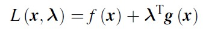  

令  
  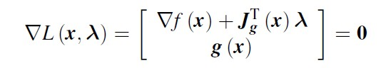  

得到临界点(x*,λ*)  

####一维优化  
**黄金分割搜索**  
与二分搜索相似  
收敛速度是线性的：C = 0.618  

**逐次抛物插值**  

	取两个端点和近似极值点，利用这三个点进行二次多项式的插值  
	取插值的二次多项式的最小值点作为函数极值点新的近似  
一般情况下，当初始点接近极值点时能够收敛  

超线性收敛：r = 1.324  

**牛顿法**  
将泰勒展开截断到二阶，有  
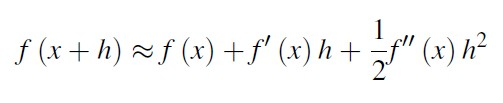 

迭代公式为：  
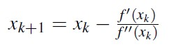 

当初始点与极值点足够接近时，牛顿法是平方收敛的  

**保护法**    
与非线性方程的迭代解法一样，一维优化的迭代解法中有  

	收敛速度慢但安全可靠的黄金分割搜索
	收敛速度快但风险大的逐次抛物插值和牛顿法
因此在实际应用中，经常采用混合方案

###多维优化  
**最速下降法**  
最速下降迭代公式为：xk+1 = xk -αk ▽f (xk)  
其中αk为  
 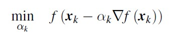  
最速下降法的收敛速度是线性的  
初值的选择很重要  

**牛顿法**  
迭代公式  
 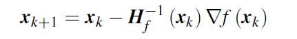  
牛顿法是平方收敛的，要比最速下降法的收敛速度快得多  
但只有初始点距离问题最优解很近时，牛顿法才是收敛的  
牛顿法并不需要搜索参数  
如果Hf (x) 不正定，得到的方向不一定是函数的下降方向，需要另行处理  

##拟合问题
-《科学计算导论》3.1-3.4、3.5.1《数值方法与计算机实现》6.2.1、6.2.4、2.5.3
拟合问题的一般形式
给定m 个数据点(xi，yi)，假设x 和y 满足y = f(t，x)，t 为参数向量找到最佳的参数向量t，使得代价函数：
min(t) Σ[yi-f(t,xi)]2  
###超定方程与欠定方程
给定线性方程组Ax = b，其系数矩阵A 为m×n 维，我们已经讨论了m = n 时的求解问题  

	如果m > n：方程的数目多于未知数的数目，称为超定方程
	如果m < n：方程的数目少于未知数的数目，称为欠定方程

**最小二乘**  
若系数矩阵A 的各列线性独立，即rand (A) = n，则解是唯一的  
若系数矩阵A 欠秩，即rand (A) < n，则解是不唯一的

**正规方程**  
用Cholesky 分解法求解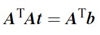  

复杂度：  
方程变换：主要是矩阵相乘，复杂度约为(mn^2)/2  
Cholesky 分解法：复杂度约为n^3/6  
正规方程方法可能会导致敏感性的恶化

**QR 分解**  
对于m×n 的矩阵A，寻找一个m×m 的正交变换阵Q，使得  
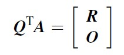  
通过一组Householder 变换，实现了对系数矩阵的QR 分解  
详细请看求解举例，过程较为繁琐，不一一列举。  
 由乘法次数考察基于Householder 变换的QR 分解复杂度  
对于m×n 的系数矩阵，需要引入n 个Householder 变换阵
对一个列矢量进行Householder 变换，需进行的乘法为2 (m-i)  
总的乘法次数为  
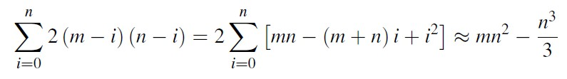  

**效率比较**  
当m≈n 时，两种方法相当  
当m>>n 时，QR 分解的复杂度是正规方程方法的两倍  

##插值
-《科学计算导论》7.1、7.2、7.3.1-7.3.3《数值方法与计算机实现》5.1、5.2.1、5.4.1
利用数学函数在已知点上的取值计算其它点上的值  
插值函数在基底函数张成的集合中，是基底函数的线性组合  
**存在性和唯一性**  
如果给定m个数据点和n个基底函数，则At=y的系数矩阵A 是m×n维  

	m > n，插值问题一般没有解
	m < n，插值问题解不唯一
	m = n 且系数矩阵A 不奇异，插值问题有唯一解，插值函数可以精
确地通过给定数据点参数t求解的敏感性取决于系数矩阵A的条件数cond (A)，系数矩阵就与基底函数的选择有很大关系

**单项式基底**  
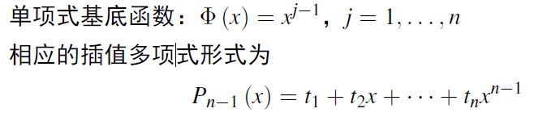  
**霍纳法则**  
对于多项式：Pn-1 (x)   
求解复杂度
  
	加法n次  
	乘法：n(n+1)/2  

按霍纳法则改写为  
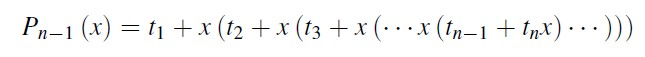  

复杂度：加法n 次，乘法也是n 次

**拉格朗日插值**  
拉格朗日基底函数  
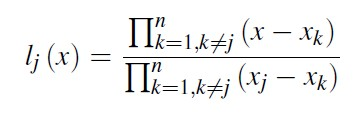  
拉格朗日插值多项式  
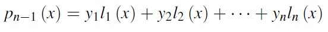  

**牛顿基底函数**  
牛顿基底函数  
  
牛顿插值多项式  
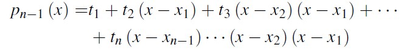  

#算法设计  

##蛮力法
不采用任何技巧，基于问题的描述直接地解决问题的方法  

	蛮力字符串匹配
	求两个整数的最大公因子
	查找元素
	百元买百鸡问题
 性能分析

	一般来说，蛮力法的效率相对较低
	蛮力法的思路很直接，实现简单，也容易被理解
	对于一些规模较小的问题，采用蛮力法是一种很经济的做法
	蛮力法的重要意义：作为求解问题的基本方案，用于衡量其它方法的正确性和效率

##分治法
把问题的一个实例分解成为属于同一问题的若干个较小规模的实例  
重复这个过程直到规模较小的实例很容易求解  
求解这些规模较小的实例  
合并较小问题的解，以得到原始问题的解  
	
	快速排序
	二叉树遍历
	大整数乘法
	矩阵乘法
效率估计:  
分治法并不总是能够改进时间复杂度  
好的情况可以将O(n^2)优化到O(nlog n)  

**减治法**    
减治法是把问题转化为规模较小的子问题，通过求解子问题来得到
原问题的解
对于有些问题，减治法与分治法存在一定的相关性

	减一个常量：选择排序
	减一个常因子：折半查找、二分法求解非线性方程
	减可变规模：辗转相除法

**与分治法的区别**  
分治法是将原问题分解成若干个同类型的小规模问题，但每个小规模问题都要处理，并且最后要合并  
减治法则每次都减小问题的规模，即使分解成若干个同类型的小规模问题，一般只需要处理其中的一个  

**变治法**  
把一个求解困难的问题转换成为一个有已知解法的问题，并且这种转换的复杂度不超过求解目标问题的算法复杂度

	对无序表的顺序查找=>对无序表排序+ 对有序表的二分查找  
	线性方程组的求解

##搜索算法  
基于状态空间树的回溯法和分支界限法为组合难题大规模实例的求解提供了可能性  
但回溯法和分支界限法都不能保证求解的效率  
**高效求解组合优化问题的核心依然是数学**   
###最优化问题  
最优化问题  

	目标函数
	约束条件
	可行解
	最优解

面向数值问题的最优化

	无约束规划，有约束规划
	线性规划，非线性规划，二次规划，凸规划，整数规划

可行解离散的优化问题：组合优化  

	八皇后问题
	旅行商问题
	背包问题

**回溯法**  

回溯法可以看作是对解空间状态树的**深度优先搜索**  

如果能够确定状态空间树上某个结点对应的部分解是没有希望的，则可以终止对其后续分支的搜索  

**分支界限法**  
估算解的下界  
利用解的下界帮助进行分支遍历的选择，是分支界限法的一种，称为最佳优先分支边界

##贪心算法-《数据结构与算法》5.5.4
	找零钱  
	背包问题
	编码问题
	找工作问题

通过一系列步骤来构造问题的解，每一步都是对当前已经存在的部分解的一个扩展，直至获得问题的完整解  
每个扩展步骤满足  

	可行性
	局部最优
	不可取消
**不是所有的优化问题都能用贪心算法求解**  
**如果一个优化问题，通过一系列的局部最优选择就可以得到问题的全局最优解，我们就说这个问题满足贪心选择性质**

	采用贪心算法求解优化问题时，可能存在多种贪心策略
	不同的贪心策略具有不同的性能
###满足贪心选择性质的例子  
	求最小生成树的Prim 算法
	求最小生成树的Kruskal 算法
	求单源最短路径的Dijkstra 算法
	Huffman 树和Huffman 编码
	最速下降法

##动态规划-《数据结构与算法》5.6.4
	阶段：把问题分成相互联系的有顺序的几个环节，称为阶段
	状态：某阶段的出发位置称为状态，即对该时刻进展情况的描述
	决策：从某阶段的一个状态演变到下一个阶段某状态的选择
**最优化原理:**对前面的决策所形成的状态而言，余下的部分决策必须构成最优策略  
**无后效性：**过去只通过当前状态影响未来，当前状态是历史的总结  

动态规划用空间换时间，在有大量重叠子问题的时候其优势才能充分体现出来  
典型的动态规划算法  

	求解图的全源最短距离的Floyd 算法
	解卷积码的Viterbi 算法

##随机算法
对某个特定输入的每次运行过程是随机的，运行结果也可能是随机的  
算法举例：  
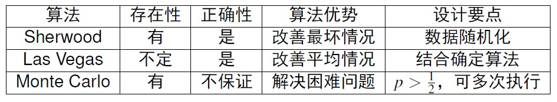  

Sherwood 算法可以有效消除算法性能和输入数据实例之间的联系   
LAS VEGAS 算法在算法求解过程中引入随机性决策,往往能够加快求解过程，并且得到的解一定是正确的,可能会找不到解，或者找不到所有的解  
MONTE CARLO 算法是以概率为基础的统计模拟方法,并不保证得到的解一定是正确的

##算法优化
提高算法性能的思维方式具有鼓励性和经验性  
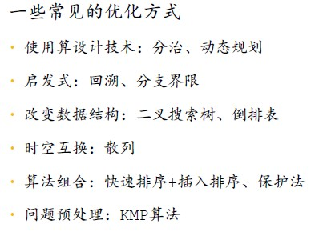  (From陈建生课件)  
算法的优化需要对算法的特性和要解决的问题有一定的了解，因此建议详细阅，这里只列出了提纲(so sorry)  
###输入增强技术
	KMP 算法
	Boyer-Moore 算法
	计数排序
###预构造技术
	二叉搜索树
	倒排索引
	并查集
	堆和堆排序

###时空平衡
牺牲空间换取时间or牺牲时间换取空间  
（一般来讲，由于存储的廉价和快速提高，前者的应用较多）  
散列依靠存储空间的冗余来解决冲突问题，进而实现更高的查找效率

###算法的组合
	快速排序的改进
	非线性方程迭代的保护法

##计算复杂性
**算法性能分析**
算法稳定性：排序稳定性、数值稳定性等
时间复杂度与渐进表示O(n^2)
空间复杂度：占用存储空间的大小
处理器复杂度：占用处理器的多少

###图灵机
	多道图灵机与标准图灵机的计算能力相同
	多带图灵机与标准图灵机的计算能力相同
	多道多带图灵机与标准图灵机的计算能力相同

	只有两个状态的图灵机与标准图灵机的计算能力相同
	只有两个符号的图灵机与标准图灵机的计算能力相同
###P与NP问题  
**P/NP 问题**  
复杂度类P即为所有可以由一个确定型图灵机在多项式表达的时间内解决的问题；类NP由所有可以在多项式时间内验证解是否正确的决定问题组成(From wikipedia)  

#考试
	注重概念的理解
	注重算法的解题思路
	注重知识的掌握和灵活运用
	不考名词解释
From(白铂)

	试题种类：填空题、简答题、问答题
	试题覆盖：以课堂讲授为准
	非数值：数值：算法 5:3:2
From(陈建生)

---
以上  
By [jas0n1ee](mailto:i@jas0n1ee.me)  
全文[源文件](https://github.com/jas0n1ee/SketchofD-A)托管在Github中

