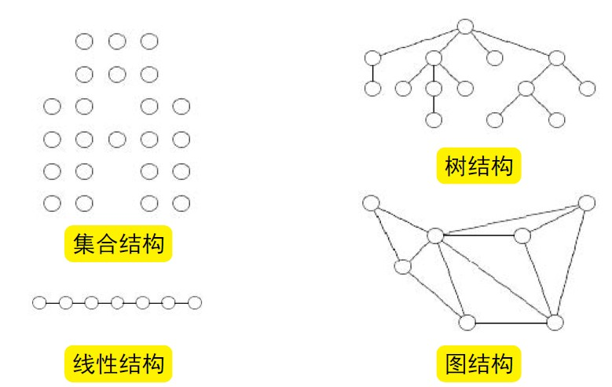
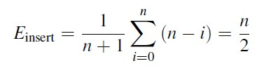
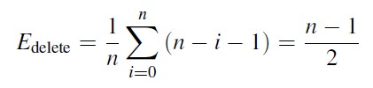
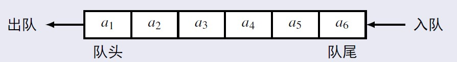
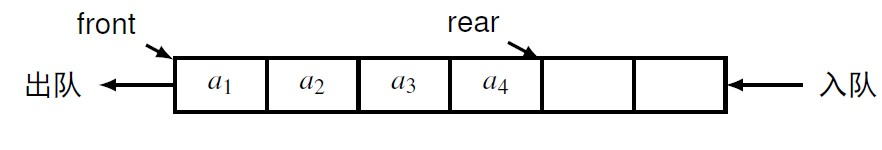
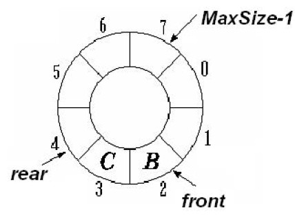
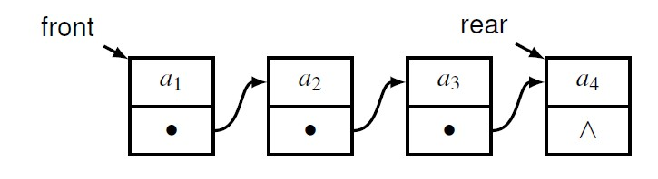
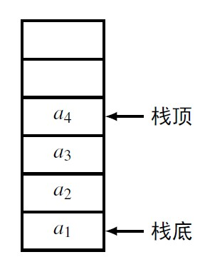
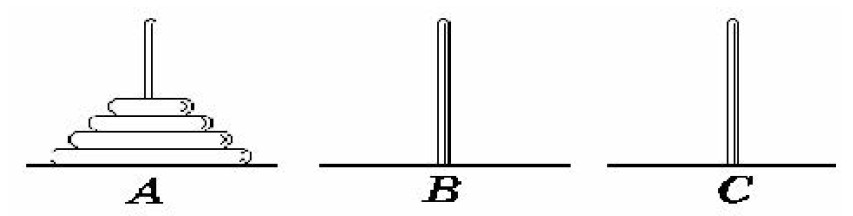

#△非数值问题
##数据结构：具有特定组织结构的数据元素的集合(逻辑结构&存储结构)
###数据元素和数据项  
**数据元素**（Data Element）：数据的基本单位  
**数据项**（Data Item）：数据结构中讨论的最小单位  
##二元关系和抽象数据类型
###二元关系	-《数据结构与算法》1.1.2、1.1.3
   **定义：设集合M和N的笛卡尔积为M×N，M×N的任意子集R称为M到N的一个二元关系。**

		若(a，b)∈R，则称a为R的前件，称b为R的后件  
		若M= N，则R∈M×M称为M上的二元关系
###常见二元关系
	=、≤、≥   
	等价关系  
	偏序关系  
	全序关系  
	逆序关系
请自行脑补大一上的离散课
###抽象数据类型（ADT）-《数据结构与算法》1.3
ADT是一个数学模型及定义在该模型上的一组操作  
数据抽象：描述的是实体的本质特征、功能及外部用户接口  
数据封装：将实体的外部特性和内部实现细节分离，对外部用户隐藏内部实现细节，使得使用和实现分离  
**描述方法：**  

	ADT 抽象数据类型名{
	数据对象：〈数据对象的定义〉
	数据关系：〈数据关系的定义〉
	基本操作：〈基本操作的定义〉
	基本操作名（参数表）
	初始条件：〈初始条件描述〉
	操作结果：〈操作结果描述〉
	} ADT 抽象数据类型名
编者按：ADT不同于伪代码，它更接近于真实的代码，但它的作用并不是编译成程序运行，而是对一个数据类型（结构）做一个代码风格的说明。（至于我说的靠不靠谱你们自己判断吧(╯‵□′)╯︵┻━┻）
##数据的逻辑结构   
  
###几种常见的逻辑结构      
  
**常见的存储结构**  
顺序存储  
链式存储

##线性表  -《数据结构与算法》2.1、2.2、3.1、3.3
**线性表是一种有序结构，长度定义为线性表中元素的个数**  
线性表的合并  

	假设有两个线性表La和Lb，要将两个线性表合并，即将所有在线性表Lb中但不在La中数据元素插入到La中  
线性表的保序归并  

	已知线性表La和Lb中的元素按值的递增顺序排列，要求将两个线性表归并成为一个新的有序线性表Lc

###存储

**顺序存储**   
插入操作复杂度期望  

删除操作复杂度期望  

**单向链表**  

	数据域：存储数据元素
	指针域：指向直接后继结点
插入删除操作复杂度为 遍历O(n)+操作O(1)  
**存在问题：单向链表的插入和删除操作，需单独考虑头结点的情况**
	
	解决方法：带表头结点的单向链表

**双向循环链表** 原理同单向链表
###优缺点

	线性表的顺序存储——顺序表  
	形式：用一组地址连续的存储单元依次存储线性表的数据元素  
	优点：可随机存取  
	缺点：插入和删除操作需要移动表中的数据元素；事先确定规模，空间效率不高  
	
	线性表的链式存储——链表  
	形式：用一组任意的存储单元（附加指针）存储表中的数据元素  
	优点：插入和删除操作无需移动表中的数据元素；无需事先确定规模，空间利用率高  
	缺点：不能随机存取  
##队列-《数据结构与算法》2.5.1-2.5.3、3.2.2
队列是限定在表的一端进行插入，而在另一端进行删除的线性结构  
  

**顺序队列**  
   
 入队：新元素加入rear指示的位置，rear指针进一：`rear = rear + 1 `   
 出队：取出front指示的元素，front指针进一：`front = front + 1`

**循环队列**  
   
rear指向maxSize-1，入队进到0  
front指向maxSize-1，出队进到0  
指针操作的求模（求余）实现  

	出队: front = (front + 1) mod n
	入队: rear =(rear + 1) mod n

**链式队列**  
   
入队时没有队满的问题  
出队时则有**队空的问题**  
  
##栈-《数据结构与算法》2.3、3.2.1、2.4.1、2.4.4
栈是只允许在一端进行插入和删除操作的线性结构  
允许插入和删除操作的一端称
为栈顶（Top），另一端称
为栈底（Bottom）  
  
插入操作称为入栈（Push）
删除操作称为出栈（Pop）  
**顺序栈**  
*时间复杂度*:  
顺序栈的操作，如进栈和出栈，都是O(1)时间复杂度  
**链式栈**  
*时间复杂度:*  
链式栈的基本操作，如进栈和出栈，都是O(1)时间的  
链式栈的建立和销毁是O(n)时间的
###应用
栈的显示应用：括号匹配、表达式求值、进制转换、迷宫求解  
栈的隐式应用：函数调用、递归

##递归
编者按：为什么在这里会提到递归？递归减少了程序的代码量，但却增加了程序的“不稳定因素”。由此引出消除递归的必要，与栈在消除递归中的应用。  
**若一个过程直接地或间接地调用自己, 则称这个过程是递归的**  
斐波那契数列  
汉诺塔问题  
 

	void move(int n, int x, int z, int y) 
	{
		if (n >= 0) 
		{
			move(n-1, x, y, z);
			printf(“Move disk %d from %d to %d”, n, x, z);
			move(n-1, y, z, x); 
		}
	}
当n越大时，递归层数越多，系统容易爆栈，因而要消除递归  
###递归的消除
一部分递归可直接用循环实现其非递归过程  
一部分递归可用递推实现其非递归过程  
很多情形必须借助显式的栈来实现非递归过程

